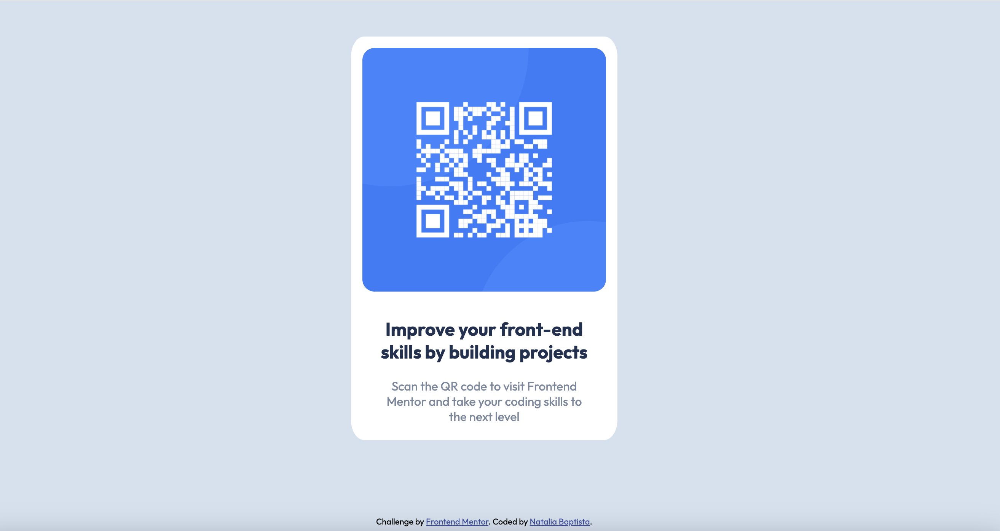

# Frontend Mentor - QR code component solution

This is a solution to the [QR code component challenge on Frontend Mentor](https://www.frontendmentor.io/challenges/qr-code-component-iux_sIO_H). Frontend Mentor challenges help you improve your coding skills by building realistic projects.

## Table of contents

- [Overview](#overview)
  - [Screenshot](#screenshot)
  - [Links](#links)
- [My process](#my-process)
  - [Built with](#built-with)
  - [What I learned](#what-i-learned)
  - [Continued development](#continued-development)
  - [Useful resources](#useful-resources)
- [Author](#author)

## Overview

This is a simple QR code component built with HTML and CSS.

### Screenshot



### Links

- Solution URL: [Add solution URL here](https://nanab210.github.io/QR-code-component/)

### Built with

- Semantic HTML5 markup
- CSS custom properties
- Flexbox
- CSS Grid
- Mobile-first workflow

### What I learned

I've been focusing on FlexBox learning and think this was a nice challenge to practice it.

```css
.container {
  max-width: 680px;
  display: flex;
  justify-content: center;
  align-items: center;
  margin-top: 50px;
}
```

### Continued development

I will focus practicing FlexBox and CSS grid as I still find these a challenge.

### Useful resources

- [Example resource 1](https://css-tricks.com/snippets/css/a-guide-to-flexbox/) - This is an amazing article which helped me finally understand FlexBox. I'd recommend it to anyone still learning this concept.
- [Example resource 2](https://coolors.co/image-picker) - This tool I use to extract pallete colors from images. An alternative for those who don't have adobe premium.

## Author

- Website - [Natalia Baptista](https://www.nataliaborges.me)
- Frontend Mentor - [@nanab210](https://www.frontendmentor.io/profile/nanab210)
